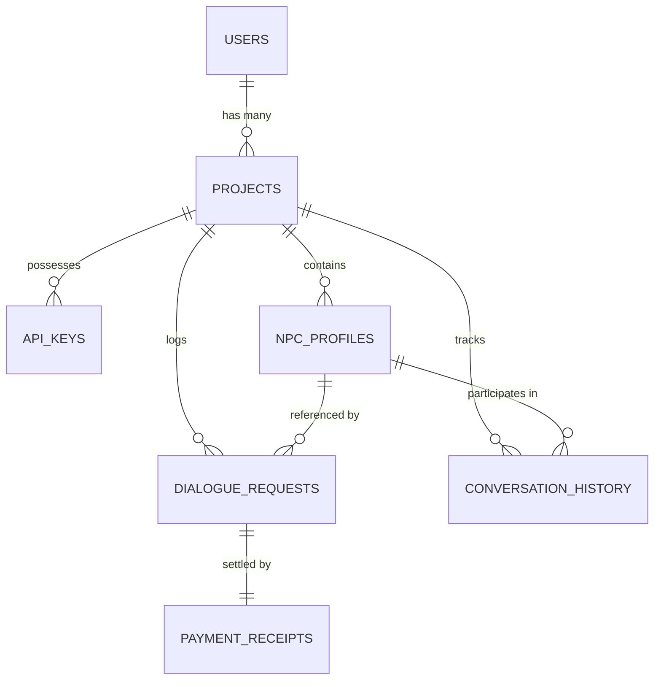

# System Architecture Documentation

This document describes the structural design, data flow, and file layout of the Dynamic NPC Dialogue system.

---

## 1. Directory Structure

The project follows a standard Next.js App Router structure:

```
brainwave(x402)/
├── drizzle.config.ts        # Drizzle database migration configuration
├── package.json             # Scripts & dependencies
├── scratch/
│   └── test-integration.js  # End-to-end integration test runner
├── src/
│   ├── app/                 # Next.js App Router Pages & API Routes
│   │   ├── api/             # Backend API endpoints
│   │   │   ├── auth/        # Login, logout, signup APIs
│   │   │   ├── dashboard/   # Console analytics stats API
│   │   │   ├── generate-dialogue/ # x402-metered LLM dialogue API
│   │   │   ├── keys/        # API key management endpoints
│   │   │   ├── logs/        # Billing history log endpoints
│   │   │   └── npcs/        # NPC profile CRUD endpoints
│   │   ├── dashboard/       # Developer UI Console pages
│   │   ├── login/           # Dev login page
│   │   └── signup/          # Dev signup page
│   ├── db/                  # Database schema & client modules
│   │   ├── index.ts         # Database initialization (Real pg / mockDb switch)
│   │   ├── mock-db.ts       # In-memory mock database client for sandboxes
│   │   └── schema.ts        # Drizzle relational schema definitions
│   ├── lib/                 # Core server utility libraries
│   │   ├── auth.ts          # Session helper functions
│   │   ├── llm.ts           # Google Gemini / NVIDIA NIM interface
│   │   └── x402.ts          # Cryptographic x402 payment logic
│   └── sdk/                 # Client integrations
│       ├── index.ts         # TypeScript Web3 SDK
│       └── X402DialogueClient.cs # Unity (C#) Client web request script
```

---

## 2. Component Design & Tech Stack

### 2.1 Web Framework
*   **Next.js 16** with React 19 and Tailwind CSS v4.
*   The dashboard pages are client-side components (`use client`) that fetch data asynchronously from `/api/` endpoints to keep page loading instant.

### 2.2 Database Layer (Drizzle ORM + PG)
*   **Drizzle ORM** translates TypeScript models directly into PostgreSQL tables.
*   **Mock Database Fallback**: A custom in-memory client ([mock-db.ts](file:///d:/brainwave(x402)/src/db/mock-db.ts)) matches Drizzle's query structures (`findFirst`, `findMany`, `insert`, `update`, `select`). It automatically takes over if the `DATABASE_URL` is omitted or if a connection is refused, allowing local testing without database infrastructure.

### 2.3 Cryptography & Payments (`ethers.js`)
*   Uses **EIP-191 Personal Sign** (`ethers.verifyMessage`) to recover player wallet addresses from the signed dialogue payment challenges.
*   Integrates a JSON-RPC provider pointing to the **Base Sepolia** testnet to optionally verify transactions.

### 2.4 Generative AI Integration
*   The system prompts the LLM with the NPC's backstory, active tone, context, current player state, and multi-turn dialogue history.
*   It utilizes the **NVIDIA NIM API** (`meta/llama-3-70b-instruct` or `nvidia/llama-3.1-nemotron-70b-instruct`) or falls back to the **Google Gemini API** (`gemini-1.5-flash`). If both fail or credentials are omitted, it falls back to a realistic mock response generator based on keywords in the context (e.g. magic, shop).

---

## 3. Data Model Relationships

The following entity diagram displays the relational mapping defined in [schema.ts](file:///d:/brainwave(x402)/src/db/schema.ts):



*   **Users**: Platform developers.
*   **Projects**: Segregated workspaces representing different games.
*   **API Keys**: Hashed credentials permitting client-side game builds to hit the dialogue generation endpoint.
*   **NPC Profiles**: Character backstories, tones, and speaking rules.
*   **Dialogue Requests**: Audit trails for billing. Status transitions from `CHALLENGE_ISSUED` $\rightarrow$ `PAID_COMPLETED` or `FAILED`.
*   **Payment Receipts**: Persistent records of settled USDC micropayment transactions on-chain.
*   **Conversation History**: Multi-turn history mapped to `(playerAddress, npcId)` for context continuity.
*   **Spent Nonces**: Cryptographic replay protection ledger.
