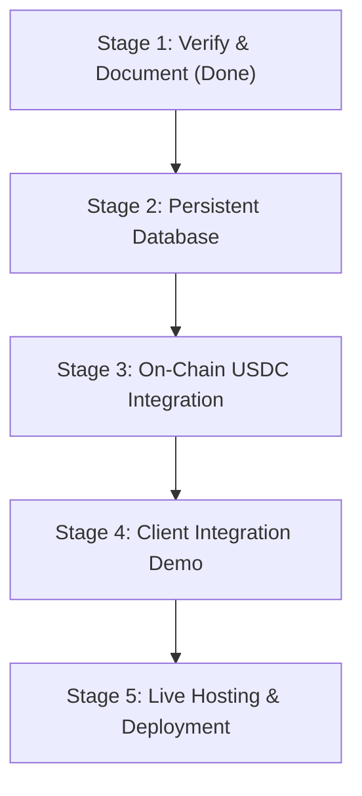

# Brain Log & Roadmap

This document serves as the project's brainstorm pad and development log.

---

## 1. Development Accomplishments (Hackathon MVP)

*   **Next.js Server & APIs**: Programmed `/api/generate-dialogue` with a dual-phase (`challenge` / `settle`) flow implementing the x402 payment challenge protocol.
*   **Database Fallback**: Added a complete TypeScript in-memory mock database runner ([mock-db.ts](file:///d:/brainwave(x402)/src/db/mock-db.ts)) replicating Drizzle ORM APIs to enable developer testing without Postgres setup.
*   **AI Fallbacks**: Configured Nvidia NIM and Google Gemini endpoints with deterministic character context mock dialogue fallback routines.
*   **Unity C# Client**: Drafted a standard web request client SDK to hook game objects straight into the API.
*   **Developer Console UI**: Designed dark-themed dashboards, API key creators, logging tables, and NPC generators.

---

## 2. Active Roadmap



### Stage 2: Persistent Database Setup
*   Run a local PostgreSQL database inside a Docker container:
    ```bash
    docker run --name pg-dnd -e POSTGRES_PASSWORD=postgres -p 5432:5432 -d postgres
    ```
*   Enable `DATABASE_URL` inside [.env](file:///d:/brainwave(x402)/.env).
*   Push the Drizzle models using `npm run db:push` to establish relational keys.

### Stage 3: On-Chain USDC Smart Contract Integration
*   Write a contract listener using `ethers.Contract` in [x402.ts](file:///d:/brainwave(x402)/src/lib/x402.ts) to verify real USDC ERC-20 transfers.
*   Configure the merchant's recipient address in the backend environmental secrets.

### Stage 4: Client Game SDK Demo
*   Create a simple console script in JavaScript or C# that queries `/api/generate-dialogue` with a mock player wallet.
*   Validate transaction settlement times and signature recovery speeds.

### Stage 5: Live Hosting & Cloud Deployments
*   Prepare the project for deployment on Vercel or Render.
*   Configure a hosted PostgreSQL database (e.g. Supabase, Neon) to maintain global game profiles.
