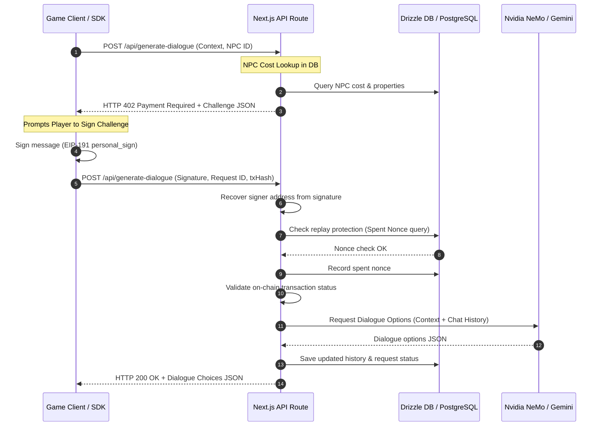

# x402 Protocol Code Review & Verification Report

This report documents the architectural structure, cryptographic security patterns, test execution outcomes, and design recommendations for the **x402 Micropayment Protocol - Dynamic NPC Dialogue Platform**.

---

## 🏗️ System Architecture & Codebase Walkthrough

The platform implements a Web3-integrated pay-per-call dialogue service. A dialogue flow initiates with an HTTP 402 challenge, requiring the client to cryptographically sign a challenge before gaining access to the stateful LLM-generated NPC response.

### Key Modules Evaluated

1. **[`src/sdk/index.ts`](file:///d:/brainwave(x402)/src/sdk/index.ts)**
   * **Role**: Client-side library wrapper for game clients.
   * **Functionality**: Performs the initial call, intercepts the `HTTP 402` response, constructs the EIP-191 challenge string, prompts the user's wallet signer to sign it, and submits it back with a mock/live transaction hash.

2. **[`src/lib/x402.ts`](file:///d:/brainwave(x402)/src/lib/x402.ts)**
   * **Role**: Cryptographic validation and billing handler.
   * **Security features**: 
     * **EIP-191 Personal Sign Standard**: Formats and verifies the payment challenge message.
     * **Replay Protection**: Stores spent nonces in `spent_nonces` table to prevent re-submitting signed challenges.
     * **On-chain Validation**: Connects to the Base Sepolia network to inspect the status of the transaction hash.

3. **[`src/lib/llm.ts`](file:///d:/brainwave(x402)/src/lib/llm.ts)**
   * **Role**: Dialogue inference orchestrator.
   * **Flow**:
     * Attempts Nvidia NIM endpoint (`nvidia/llama-3.1-nemotron-70b-instruct`).
     * Falls back to Google Gemini (`gemini-1.5-flash`).
     * Fallback mock generator `generateMockDialogue` handles failures gracefully when API keys are unconfigured or invalid, matching text patterns (`wizard`, `shop`, etc.) to produce realistic game lines.

4. **[`src/db/schema.ts`](file:///d:/brainwave(x402)/src/db/schema.ts)**
   * **Tables Evaluated**:
     * `users`: Developer credentials.
     * `projects`: Developer projects holding keys and NPCs.
     * `npc_profiles`: Stores `cost`, `backstory`, `tone`, `style`, `safety_rules`.
     * `dialogue_requests`: Records transaction states (`CHALLENGE_ISSUED`, `PAID_COMPLETED`).
     * `spent_nonces`: Primary replay protection index.
     * `conversation_history`: JSONB structure preserving the multi-turn memory role logs.

---

## 🧪 Integration Sandbox Verification

An automated integration script was executed using **Bun** to verify the end-to-end cycle. The database fell back to the mock in-memory DB configuration due to local Postgres port unavailability, which is the expected fallback design.

### Execution Log Summary
* **Simulated Wallet Address**: `0x891d2D0C36Ab412141a6cd05eEcd6Afeb60443d4`
* **Turn 1: Initial Challenge Issued & Signed**:
  * Challenge parameters: NPC price `$0.0250` USDC on Chain ID `84532`.
  * Nonce generated: `0xcde9167...`
  * EIP-191 Signature recovered and verified: Succeeded.
  * Dialogue fallback generation succeeded (Gemini API invalid key fallback generated Bartender option: *"Hello there. My name is Garrick the Bartender. How can I assist you in your quest?"*).
  * State written to database conversation history.
* **Turn 2: Stateful Continuation**:
  * Context: orders a drink and asks where to find the wizard.
  * History loaded: Succeeded (retrieved 2 messages).
  * Signature and payment challenge successfully settled.
  * Fallback generator parsed text input context `"wizard"` and correctly adapted model choices: *"Ah, traveler. The ley lines are whispering of your arrival. What brings you to my sanctum?"*.
* **Conversation History Reset**:
  * Cleaned records for player and NPC. Checked database verification: Succeeded.
* **Final Result**: **All integration tests passed successfully.**

---

## 💡 Recommendations & Future Proofing

1. **Transaction ID Tight Coupling**:
   * *Observation*: The SDK generates a random client-side transaction hash. For true monetization, the game client must submit a real on-chain transaction hash.
   * *Recommendation*: The backend should check the transaction `to` address (matching the merchant wallet), the transfer `amount` (matching the challenge cost), and `token` contract address on the chain rather than returning `true` on verification fallbacks.

2. **Nonce Time-to-Live (TTL)**:
   * *Observation*: Nonces are saved forever in the `spent_nonces` table.
   * *Recommendation*: Introduce a timestamp inside the challenge. If a challenge is older than 5-10 minutes, reject it. This allows deleting nonces from the database after they expire, preventing unbounded table growth.
