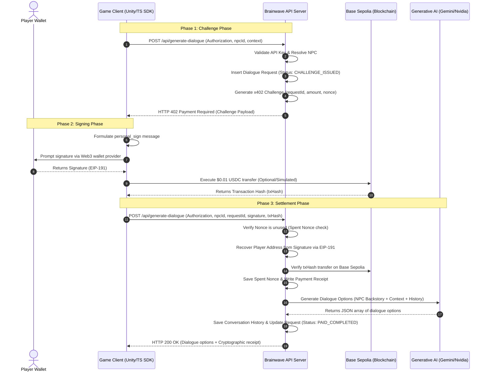

# x402 Micropayment Workflow

This document explains the step-by-step cryptographic sequence that enables dynamic, pay-per-call AI dialogue generation using the **x402 protocol**.

---

## 1. Sequence Diagram



---

## 2. Phase Breakdown

### Phase 1: Challenge Phase (Initial Request)
1.  The Game Client makes a standard HTTP POST request to `/api/generate-dialogue`.
2.  The server checks the `Authorization` header, hashes the API key, and matches it to a project.
3.  The server verifies the NPC profile belongs to the project and is active.
4.  The server inserts a row in the `dialogue_requests` database table with status `CHALLENGE_ISSUED`.
5.  A challenge object is constructed:
    ```typescript
    interface X402Challenge {
      requestId: string;     // Database ID of the dialogue request
      merchantAddress: string; // Dev address receiving USDC
      amount: string;          // Flat cost, e.g. "0.0100"
      token: string;           // "USDC"
      chainId: number;         // e.g. 84532
      nonce: string;           // Random 32-byte hex string
    }
    ```
6.  The server returns the challenge details with status `402 Payment Required`.

---

### Phase 2: Signing Phase (Client Signature)
1.  The Client receives the challenge payload and formats it into a standard EIP-191 signing message:
    ```
    x402 Payment Challenge
    Request: <requestId>
    Amount: <amount> <token>
    Merchant: <merchantAddress>
    Chain ID: <chainId>
    Nonce: <nonce>
    ```
2.  The Client prompts the player's connected wallet (e.g. MetaMask, Sequence, Thirdweb embedded wallet) to sign this message.
3.  The client signs the transaction on the Base Sepolia testnet to pay the merchant, generating a Transaction Hash (`txHash`).

---

### Phase 3: Settlement Phase (Verification & Generation)
1.  The client retries `/api/generate-dialogue`, sending the signature, `requestId`, and `transactionHash` in the body.
2.  The server formats the identical message text and uses `ethers.verifyMessage` to recover the player's wallet address.
3.  **Replay Check**: The server queries the `spent_nonces` table. If the nonce from the challenge has already been used, it rejects the request to prevent double-spending or signature reuse.
4.  **Transaction Verification**: The server queries Base Sepolia via JSON-RPC to confirm that the `txHash` refers to a valid transfer of the challenge amount to the merchant.
5.  **LLM Dialogue Generation**: The server retrieves the conversation history for the player address + NPC. It passes the backstory, history, and context to the LLM (Nvidia Llama / Google Gemini).
6.  **Update Log**: The server saves the receipt, logs the LLM response, updates the request status to `PAID_COMPLETED`, and returns the dialogue options to the game client.
